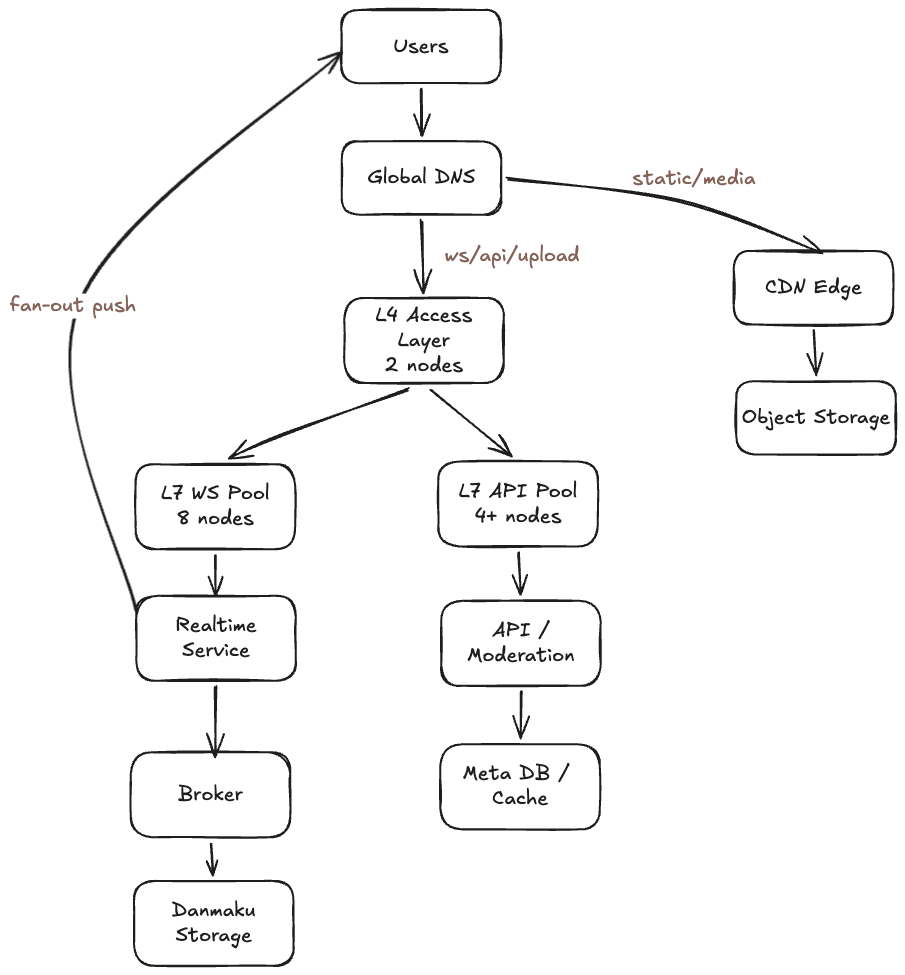

# Bilibili Live Данмаку

# 1. Тема, аудитория, функционал

## Тема

Проектируемая система представляет собой систему данмаку (чат сообщений) для прямых трансляций, аналогичную системе чата в Bilibili Live.

Система обеспечивает обмен текстовыми сообщениями в реальном времени между зрителями внутри одной трансляции. Основная особенность системы — поддержка высокой нагрузки в условиях «горячих» стримов с большим количеством одновременных пользователей.

Ядро проекта — инфраструктура danmaku (чат сообщений).  
Дополнительно для capacity-планирования учитывается входящий видеопоток от стримеров (ingest), так как именно он определяет основной ingress-сетевой профиль live-платформы.

## Аудитория

Система ориентирована на пользователей стриминговой платформы:

- зрителей прямых трансляций
- стримеров
- модераторов

В качестве реального аналога используется платформа Bilibili Live [1].

Согласно официальному отчету Bilibili за Q3 2025 [1]:

- DAU платформы: 117,3 млн
- MAU платформы: 376 млн

Показатели DAU/MAU являются платформенными (не только live-сегмент) и используются как верхнеуровневая база для оценки нагрузки live-chat.

## Функционал (MVP)

1. Подключение пользователя к комнате трансляции.
2. Установление постоянного соединения (WebSocket).
3. Отправка текстового сообщения.
4. Мгновенная доставка сообщения всем участникам комнаты (fan-out).
5. Загрузка последних N сообщений при входе в комнату.
6. Ограничение частоты отправки сообщений (rate limiting).
7. Базовая модерация (блокировка пользователя, фильтрация запрещённых слов).

## Список использованных источников

1. Bilibili Q3 2025 Financial Results (official): https://ir.bilibili.com/media/krmdk0ls/bilibili-inc-announces-third-quarter-2025-financial-results.pdf

# 2. Расчет нагрузки

## Входные данные из открытых источников

- Q3 2025: DAU 117,3 млн [1].
- Q3 2025: MAU 376 млн [1].
- Q3 2025: среднее время в приложении 112 мин/день на DAU [1].
- Q2 2025: выручка VAS выросла в том числе за счет live broadcasting [2].
- Q1 2025: DAU 106,7 млн, MAU 368 млн, average daily time spent 108 мин [3].
- Методика расчета DAU/MAU и описание live broadcasting как части потребления контента раскрыты в Form 20-F [4].

## Проектные допущения

- Доля пользователей, которые одновременно находятся именно в live-сценарии: `8%–15%` от одновременно активных пользователей платформы.
- Коэффициент суточного пика к среднему: `1,8`.
- Коэффициент кратковременного пика сообщений к среднему: `2,5`.
- Средняя частота отправки danmaku одним live-пользователем: `0,12 msg/min`.
- Средний размер одного ingress-события danmaku (текст + метаданные): `~300 байт`.
- Пиковое число одновременно активных стримеров (видеовход): `3 000`.
- Профили видеовхода (проектные):
  - `720p / 30 fps / 2,5 Mbit/s` (доля `80%`);
  - `1080p / 30 fps / 4,5 Mbit/s` (доля `20%`).
- Средневзвешенный видеобитрейт на один входящий стрим:
  `Bitrate_video_avg = 0,8 * 2,5 + 0,2 * 4,5 = 2,9 Mbit/s`.
- Сетевой overhead ingest-протокола + аудио + служебные поля: `~20%`.

## Расчет одновременных WebSocket-соединений

Среднее число одновременно активных пользователей платформы:

`CCU_platform = DAU * (AvgTimeMin / 1440)`

Для Q3 2025:

`117 300 000 * (112 / 1440) = 9 123 333 (~9,12 млн)`

Проверка тренда метрик по кварталам 2025 (Q1→Q3) подтверждает, что для capacity-планирования корректно брать последний доступный квартал [1][3].

Оценка live-CCU:

`CCU_live_avg = CCU_platform * (8%..15%) = 729 867 .. 1 368 500`

Пиковая оценка live-CCU:

`CCU_live_peak = CCU_live_avg * 1,8 = 1 313 760 .. 2 463 300`

Итого для проектирования gateway-сервиса danmaku: **~1,3–2,5 млн одновременных WS-соединений**.

## Расчет входящего потока сообщений (ingress RPS)

Средний поток сообщений danmaku оценивается через live-CCU:

`RPS_danmaku_avg = CCU_live_avg * 0,12 / 60`

`RPS_danmaku_avg = 1 460 .. 2 737 rps`

Пиковый поток danmaku:

`RPS_danmaku_peak = 1 460..2 737 * 2,5 = 3 650 .. 6 843 rps` 

Итого расчетный диапазон ingress для кластера: **~3,7–6,8 тыс. сообщений/с**.

## Нагрузка fan-out (главный highload-фактор)

Сценарий «горячей» комнаты (проектный):

- аудитория комнаты: `200 000` одновременных зрителей;
- входящий поток в комнату: `~500 msg/s`.

Тогда исходящих доставок:

`Fanout = 500 * 200 000 = 100 000 000 deliveries/s`

## Оценка хранилища и сетевого трафика

Пиковый ingress-трафик:

`Net_in_peak = 6 843 * 300 B = 2 052 900 B/s ~= 16,42 Mbit/s`

Пиковый video-ingest трафик (с учетом качества видео):

`Net_video_in_peak = 3 000 * 2,9 * 1,2 = 10 440 Mbit/s ~= 10,44 Gbit/s`

Суммарный пиковый ingress (danmaku + video ingest):

`Net_total_ingress_peak ~= 10 440 + 16,42 = 10 456,42 Mbit/s ~= 10,46 Gbit/s`

Данные для хранения (сырой поток, без репликации):

`Storage_day_raw = 6 843 * 300 * 86400 = 177,37 GB/day`

При репликации `RF=3`:

`Storage_day_rf3 ~= 532,10 GB/day`,  
`Storage_month_rf3 (30 дней) ~= 15,96 TB/month`.

расчет хранения выше относится к данным danmaku.  
Видео обычно хранится и масштабируется в отдельном media-контуре и считается отдельно.

## Список использованных источников

1. Bilibili Q3 2025 Financial Results (official): https://ir.bilibili.com/media/krmdk0ls/bilibili-inc-announces-third-quarter-2025-financial-results.pdf
2. Bilibili Q2 2025 Financial Results (official): https://ir.bilibili.com/media/vwdbomil/bilibili-inc-announces-second-quarter-2025-financial-results.pdf
3. Bilibili Q1 2025 Financial Results (official): https://ir.bilibili.com/media/apkmmmog/bilibili-inc-announces-first-quarter-2025-financial-results.pdf
4. Bilibili Form 20-F for FY2024 (SEC filing): https://www.sec.gov/Archives/edgar/data/1723690/000119312525061847/d930276d20f.htm

# 3. Глобальная балансировка

## 3.1 Функциональное разбиение по доменам

Домены ниже являются проектными и нужны для независимого масштабирования контуров.

| Домен | Назначение | Тип трафика |
|----------|----------|----------|
| `www.bstream.cn` | web-приложение (HTML/Spa) | в основном кэшируемый |
| `static.bstream.cn` | JS/CSS/шрифты | кэшируемый (CDN) |
| `media.bstream.cn` | превью, аватары, медиа-статика | тяжелый трафик (CDN) |
| `api.bstream.cn` | REST/gRPC API (комнаты, профиль, moderation, history) | динамический |
| `ws.bstream.cn` | WebSocket вход для danmaku | long-lived соединения |
| `upload.bstream.cn` | инициация загрузки и выдача pre-signed URL | динамический |
| `s3.internal.bstream.cn` | object storage origin | внутренний |

Пример маршрутизации запросов:

| Запрос | Домен |
|----------|----------|
| Открытие страницы стрима | `www.bstream.cn` |
| Загрузка JS/CSS и статики | `static.bstream.cn` |
| Получение метаданных комнаты | `api.bstream.cn` |
| Подключение к чату danmaku | `ws.bstream.cn` |
| Получение изображений/превью | `media.bstream.cn` |
| Загрузка пользовательского контента | `upload.bstream.cn` |

## 3.2 Расположение ДЦ

Проектное решение: 2 основных региона + 1 резервный, с привязкой к городам:

- Region A (primary): Шанхай;
- Region B (active-active): Пекин;
- Region C (DR): Гуанчжоу.

Логика выбора: Шанхай и Пекин покрывают основные пользовательские кластеры и дают active-active режим, Гуанчжоу используется как географически удаленный DR-контур для снижения регионального риска; цель — уменьшение RTT и отказоустойчивость на уровне региона.

## 3.3 DNS-балансировка (GSLB)

Используется GSLB (Geo/Latency + health checks):

- `www.bstream.cn`, `api.bstream.cn`, `ws.bstream.cn`: routing на ближайший healthy-регион;
- `media.bstream.cn`, `static.bstream.cn`: CNAME на CDN-провайдера;
- при падении региона ответы DNS переводятся на соседний регион.

TTL для динамических доменов: 20-60 сек [3].

## 3.4 Anycast-балансировка (BGP Anycast)

Anycast используется на edge-уровне DNS/CDN для маршрутизации в ближайшую точку присутствия [4].

Для WebSocket (danmaku) в core-контуре опора на Anycast не делается: используется региональная привязка комнаты и stickiness-сессий (проектное решение).

## 3.5 Регулировка трафика между ДЦ

- Шардирование по `room_id`: каждая комната закреплена за primary-регионом.
- Межрегионально реплицируются только метаданные/модерация/offsets.
- Поток сообщений danmaku обрабатывается локально в primary-регионе комнаты.
- При деградации: новые сессии переводятся через GSLB, текущие переподключаются в fallback-регион.
- Для горячих комнат выделяется отдельный пул gateway+broker.

## Список использованных источников

1. Bilibili Q3 2025 Financial Results (official): https://ir.bilibili.com/media/krmdk0ls/bilibili-inc-announces-third-quarter-2025-financial-results.pdf
2. Bilibili Form 20-F for FY2024 (SEC filing): https://www.sec.gov/Archives/edgar/data/1723690/000119312525061847/d930276d20f.htm
3. AWS Route 53 Developer Guide (latency/failover routing): https://docs.aws.amazon.com/Route53/latest/DeveloperGuide/routing-policy.html
4. Cloudflare Learning Center, Anycast network: https://www.cloudflare.com/learning/cdn/glossary/anycast-network/

# 4. Локальная балансировка

## 4.1 Цель и контекст

После глобальной маршрутизации входящий трафик попадает в выбранный регион и дальше балансируется внутри ДЦ.

Для проекта важны два разных профиля:

- `api.bstream.cn`: короткие HTTP/gRPC запросы;
- `ws.bstream.cn`: долгоживущие WebSocket-соединения с danmaku.

Поэтому используется комбинированная локальная схема `L4 + L7` [1].

## 4.2 Выбранная схема внутри ДЦ

Проектное решение (на регион):

1. `Global DNS/GSLB` делит трафик на две ветки:
   - динамический (`ws/api/upload`) в локальный контур балансировки;
   - статический (`static/media`) в `CDN Edge -> Media Storage`.
2. Динамический поток заходит в `L4 Access Layer` (2 узла, active-standby).
3. После L4 трафик разделяется на два пула L7:
   - `L7 WS Pool` (8 узлов) для WebSocket и realtime-цепочки;
   - `L7 API Pool` (4+ узла) для API/moderation.
4. Realtime-ветка: `Realtime Service -> Broker -> Danmaku Storage`, затем fan-out обратно пользователям [2].
5. API-ветка: `API/Moderation -> Meta DB/Cache`; входной и сервисный контур соответствуют типовой модели `Ingress + Service` [3][4].

Краткая логика:

- `L4` закрывает быстрый и отказоустойчивый вход по IP;
- `L7` масштабируется раздельно под профиль нагрузки (`WS` и `API`);
- статический и медиа-трафик вынесен в CDN-контур и не нагружает realtime-путь.

## 4.3 Расчет количества балансировщиков

Цель расчета: определить, сколько узлов балансировки нужно на регион (`L4 / L7 WS / L7 API`).

Дано (из раздела 2):

- глобальный peak ingress: `10.46 Gbit/s`
- глобальный peak WS: `2.46M`
- active-active в 2 регионах, распределение `50/50`

### 1) Количество L4

Для входного слоя берем схему active-standby:

`N_L4 = 2`

### 2) Количество L7 для WS

WS-подключения на регион:

`WS_region = 2.46M / 2 = 1.23M`

Безопасная емкость одного WS-узла:

`Cap_ws_node = 175k connections`

Требуемое количество узлов:

`N_ws = ceil(WS_region / Cap_ws_node) = ceil(1.23M / 175k) = 8`

### 3) Количество L7 для API

API-пул задается как baseline + авторасширение:

- baseline: `4` узла
- при росте нагрузки: масштабирование по `p95 latency + CPU`

Итоговая запись:

`N_api = 4+`

### 4) Сводный результат

| Уровень | Результат |
|---|---|
| L4 Access Layer | `2` узла |
| L7 WS Pool | `8` узлов |
| L7 API Pool | `4+` узла |

Итог: на регион локальная балансировка планируется как `2 + 8 + (4+)`; статический трафик `static/media` идет через CDN и не входит в realtime-пул балансировщиков.

## Список использованных источников

1. NGINX Load Balancing: https://nginx.org/en/docs/http/load_balancing.html
2. NGINX WebSocket proxying: https://nginx.org/en/docs/http/websocket.html
3. Kubernetes Ingress Concepts: https://kubernetes.io/docs/concepts/services-networking/ingress/
4. Kubernetes Service Concepts: https://kubernetes.io/docs/concepts/services-networking/service/
