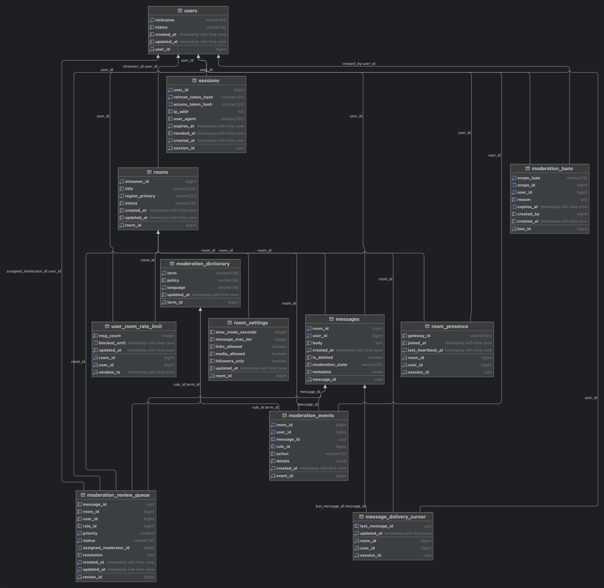
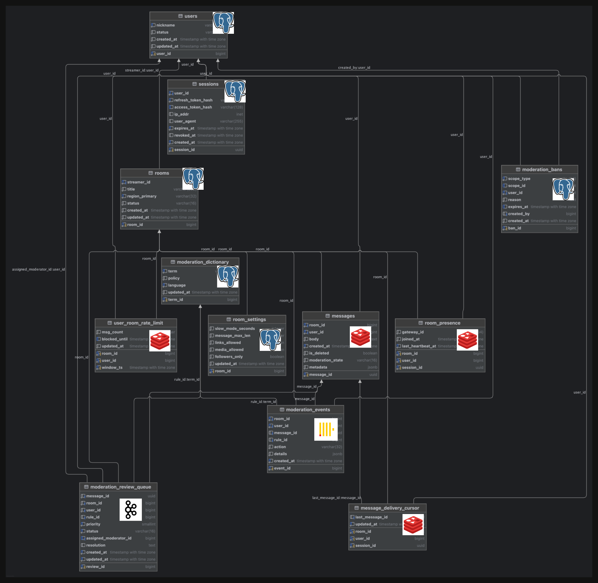
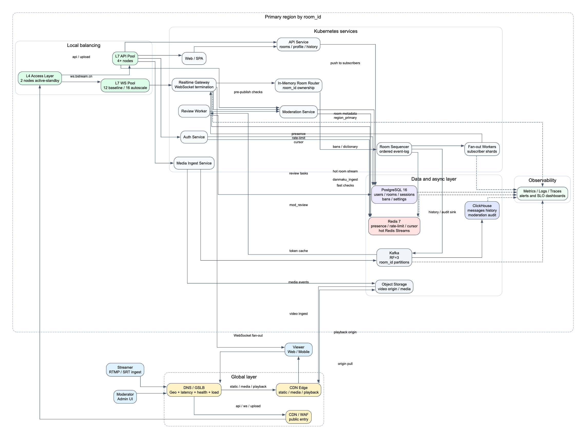

# Bilibili Live Данмаку

## Быстрый переход

- [1. Тема, аудитория, функционал](#section-1)
- [2. Расчет нагрузки](#section-2)
- [3. Глобальная балансировка](#section-3)
- [4. Локальная балансировка](#section-4)
- [5. Логическая схема базы данных](#section-5)
- [6. Физическая схема базы данных](#section-6)
- [7. Алгоритмы](#section-7)
- [8. Технологии](#section-8)
- [9. Обеспечение надежности](#section-9)
- [10. Схема проекта](#section-10)

# 1. Тема, аудитория, функционал

## Тема

Проектируемая система представляет собой систему данмаку (чат сообщений) для прямых трансляций, аналогичную системе чата в Bilibili Live.

Система обеспечивает обмен текстовыми сообщениями в реальном времени между зрителями внутри одной трансляции. Основная особенность системы — поддержка высокой нагрузки в условиях «горячих» стримов с большим количеством одновременных пользователей.

Ядро проекта — инфраструктура danmaku (чат сообщений).  
Дополнительно для capacity-планирования учитывается входящий видеопоток от стримеров (ingest), так как именно он определяет основной ingress-сетевой профиль live-платформы.

## Аудитория

Система ориентирована на пользователей стриминговой платформы:

- зрителей прямых трансляций
- стримеров
- модераторов

В качестве реального аналога используется платформа Bilibili Live [1].

Согласно официальному отчету Bilibili за Q3 2025 [1]:

- DAU платформы: 117,3 млн
- MAU платформы: 376 млн

Показатели DAU/MAU являются платформенными (не только live-сегмент) и используются как верхнеуровневая база для оценки нагрузки live-chat.

## Функционал (MVP)

1. Подключение пользователя к комнате трансляции.
2. Установление постоянного соединения (WebSocket).
3. Отправка текстового сообщения.
4. Мгновенная доставка сообщения всем участникам комнаты (fan-out).
5. Загрузка последних N сообщений при входе в комнату.
6. Ограничение частоты отправки сообщений (rate limiting).
7. Базовая модерация (блокировка пользователя, фильтрация запрещённых слов).

## Список использованных источников

1. Bilibili Q3 2025 Financial Results (official): https://ir.bilibili.com/media/krmdk0ls/bilibili-inc-announces-third-quarter-2025-financial-results.pdf

# 2. Расчет нагрузки

## Входные данные из открытых источников

- Q3 2025: DAU 117,3 млн [1].
- Q3 2025: MAU 376 млн [1].
- Q3 2025: среднее время в приложении 112 мин/день на DAU [1].
- Q2 2025: выручка VAS выросла в том числе за счет live broadcasting [2].
- Q1 2025: DAU 106,7 млн, MAU 368 млн, average daily time spent 108 мин [3].
- Методика расчета DAU/MAU и описание live broadcasting как части потребления контента раскрыты в Form 20-F [4].

## Проектные допущения

- Доля пользователей, которые одновременно находятся именно в live-сценарии: `8%–15%` от одновременно активных пользователей платформы.
- Коэффициент суточного пика к среднему: `1,8`.
- Коэффициент кратковременного пика сообщений к среднему: `2,5`.
- Средняя частота отправки danmaku одним live-пользователем: `0,12 msg/min`.
- Средний размер одного ingress-события danmaku (текст + метаданные): `~300 байт`.
- Пиковое число одновременно активных стримеров (видеовход): `3 000`.
- Профили видеовхода (проектные):
  - `720p / 30 fps / 2,5 Mbit/s` (доля `80%`);
  - `1080p / 30 fps / 4,5 Mbit/s` (доля `20%`).
- Средневзвешенный видеобитрейт на один входящий стрим:
  `Bitrate_video_avg = 0,8 * 2,5 + 0,2 * 4,5 = 2,9 Mbit/s`.
- Сетевой overhead ingest-протокола + аудио + служебные поля: `~20%`.
- Средний bitrate видеопроигрывания у зрителя (ABR, проектно): `~2,2 Mbit/s`.
- Сетевой overhead playback (HTTP/TLS/служебные заголовки): `~10%`.
- Доля CDN hit для видеосегментов (проектно): `~97%` (origin получает `~3%`).

### Обоснование проектных допущений

- `8%–15%` для `CCU_live_avg / CCU_platform`:
  доля выбрана как проектный коридор для live-платформы с учетом того, что DAU/MAU в отчетности платформенные (не только live), а внутри live-нагрузка сильно зависит от времени суток и событий.
- `1,8` (суточный пик к среднему):
  это консервативный коэффициент для вечернего прайм-тайма и ивентов; используется для capacity-планирования с запасом, а не для среднего продуктового отчета.
- `2,5` (кратковременный пик сообщений):
  нужен для burst-сценариев в «горячих» комнатах, где активность скачкообразная; коэффициент закладывает устойчивость realtime-цепочки к всплескам.
- `0,12 msg/min` на live-пользователя:
  это среднее по всей live-аудитории, включая «молчащих» зрителей; активные участники пишут существенно чаще, но их доля ограничена.
- `~300 B` на ingress-событие danmaku:
  включает полезный текст и служебные поля (room/user/message id, timestamp, флаги модерации), а не только тело сообщения.
- `3 000` одновременно активных стримеров:
  проектный верхний уровень для оценки ingest-контура в пик; используется как расчетный worst-reasonable-case.
- Профили `720p/2,5 Mbit/s (80%)` и `1080p/4,5 Mbit/s (20%)`:
  это рабочее упрощение mixed-quality профиля, чтобы получить устойчивую оценку ingress без детализации по всем кодекам и пресетам.
- `~20%` сетевого overhead:
  добавлен как инженерный запас на аудио-дорожку, служебные заголовки и протокольные накладные расходы ingest.
- `~2,2 Mbit/s` playback bitrate:
  проектное среднее для ABR-проигрывания между 720p и 1080p с учетом мобильной доли и адаптации качества.
- `~10%` playback overhead:
  учитывает накладные расходы HTTP/TLS и служебные заголовки сегментной выдачи.
- `~97%` CDN hit:
  целевое значение для массовой видеодоставки; при таком уровне hit origin нагружается только miss-долей (`~3%`).

## Расчет одновременных WebSocket-соединений

Среднее число одновременно активных пользователей платформы:

`CCU_platform = DAU * (AvgTimeMin / 1440)`

Для Q3 2025:

`117 300 000 * (112 / 1440) = 9 123 333 (~9,12 млн)`

Проверка тренда метрик по кварталам 2025 (Q1→Q3) подтверждает, что для capacity-планирования корректно брать последний доступный квартал [1][3].

Оценка live-CCU:

`CCU_live_avg = CCU_platform * (8%..15%) = 729 867 .. 1 368 500`

Здесь `CCU_platform` — это весь онлайн платформы в момент времени, а `CCU_live_avg` — только доля пользователей, которые в тот же момент смотрят live. Остальная часть онлайна находится в других сценариях (лента, поиск, VOD, сообщения и т.д.).

Пиковая оценка live-CCU:

`CCU_live_peak = CCU_live_avg * 1,8 = 1 313 760 .. 2 463 300`

Итого для проектирования gateway-сервиса danmaku: **~1,3–2,5 млн одновременных WS-соединений**.

Сводка по соединениям:

| Метрика | Формула | Значение |
|----------|----------|----------|
| `CCU_platform` | `DAU * (AvgTimeMin / 1440)` | `9 123 333 (~9,12 млн)` |
| `CCU_live_avg` | `CCU_platform * (8%..15%)` | `729 867 .. 1 368 500` |
| `CCU_live_peak` | `CCU_live_avg * 1,8` | `1 313 760 .. 2 463 300` |

## Расчет входящего потока сообщений (ingress RPS)

Средний поток сообщений danmaku оценивается через live-CCU:

`RPS_danmaku_avg = CCU_live_avg * 0,12 / 60`

`RPS_danmaku_avg = 1 460 .. 2 737 rps`

Пиковый поток danmaku:

`RPS_danmaku_peak = 1 460..2 737 * 2,5 = 3 650 .. 6 843 rps` 

Итого расчетный диапазон ingress для кластера: **~3,7–6,8 тыс. сообщений/с**.

Сводка по RPS danmaku:

| Метрика | Формула | Значение |
|----------|----------|----------|
| `RPS_danmaku_avg` | `CCU_live_avg * 0,12 / 60` | `1 460 .. 2 737 rps` |
| `RPS_danmaku_peak` | `RPS_danmaku_avg * 2,5` | `3 650 .. 6 843 rps` |

## Нагрузка fan-out (главный highload-фактор)

Сценарий «горячей» комнаты (проектный):

- аудитория комнаты: `200 000` одновременных зрителей;
- входящий поток в комнату: `~500 msg/s`.

Тогда исходящих доставок:

`Fanout = 500 * 200 000 = 100 000 000 deliveries/s`

## Оценка хранилища и сетевого трафика

Пиковый ingress-трафик:

`Net_in_peak = 6 843 * 300 B = 2 052 900 B/s ~= 16,42 Mbit/s`

Пиковый video-ingest трафик (с учетом качества видео):

`Net_video_in_peak = 3 000 * 2,9 * 1,2 = 10 440 Mbit/s ~= 10,44 Gbit/s`

Суммарный пиковый ingress (danmaku + video ingest):

`Net_total_ingress_peak ~= 10 440 + 16,42 = 10 456,42 Mbit/s ~= 10,46 Gbit/s`

## Media-контур (видеораспределение, отдельно от danmaku)

Пиковая видеонагрузка на выдачу зрителям считается от `CCU_live_peak`:

`Net_video_playback_edge_peak = CCU_live_peak * 2,2 * 1,1`

`Net_video_playback_edge_peak = 3 179 299 .. 5 961 186 Mbit/s ~= 3,18 .. 5,96 Tbit/s`

При `CDN hit = 97%` нагрузка на origin/media-core:

`Net_video_origin_peak = Net_video_playback_edge_peak * 3%`

`Net_video_origin_peak = 95 379 .. 178 836 Mbit/s ~= 95,38 .. 178,84 Gbit/s`

Сводка по типам трафика:

| Тип трафика | Что включает | Пиковая оценка |
|----------|----------|----------|
| Danmaku ingress | входящие сообщения в realtime-контур | `~16,42 Mbit/s` |
| Video ingest | входящие RTMP/SRT-потоки от стримеров | `~10,44 Gbit/s` |
| Суммарный ingress | `danmaku + video ingest` | `~10,46 Gbit/s` |
| Video playback egress (CDN edge) | выдача HLS/FLV зрителям | `~3,18 .. 5,96 Tbit/s` |
| Video origin egress (media-core) | часть playback-трафика при CDN miss | `~95,38 .. 178,84 Gbit/s` |
| Danmaku fan-out (внутренний egress) | рассылка в «горячей» комнате | `~100 000 000 deliveries/s` |

Данные для хранения (сырой поток, без репликации):

`Storage_day_raw = 6 843 * 300 * 86400 = 177,37 GB/day`

При репликации `RF=3`:

`Storage_day_rf3 ~= 532,10 GB/day`,  
`Storage_month_rf3 (30 дней) ~= 15,96 TB/month`.

расчет хранения выше относится к данным danmaku.  
Видео обычно хранится и масштабируется в отдельном media-контуре и считается отдельно.

## Список использованных источников

1. Bilibili Q3 2025 Financial Results (official): https://ir.bilibili.com/media/krmdk0ls/bilibili-inc-announces-third-quarter-2025-financial-results.pdf
2. Bilibili Q2 2025 Financial Results (official): https://ir.bilibili.com/media/vwdbomil/bilibili-inc-announces-second-quarter-2025-financial-results.pdf
3. Bilibili Q1 2025 Financial Results (official): https://ir.bilibili.com/media/apkmmmog/bilibili-inc-announces-first-quarter-2025-financial-results.pdf
4. Bilibili Form 20-F for FY2024 (SEC filing): https://www.sec.gov/Archives/edgar/data/1723690/000119312525061847/d930276d20f.htm

# 3. Глобальная балансировка

## 3.1 Функциональное разбиение по доменам

Домены ниже являются проектными и нужны для независимого масштабирования контуров.

| Домен | Назначение | Тип трафика |
|----------|----------|----------|
| `www.bstream.cn` | web-приложение (HTML/Spa) | в основном кэшируемый |
| `static.bstream.cn` | JS/CSS/шрифты | кэшируемый (CDN) |
| `media.bstream.cn` | превью, аватары, медиа-статика | тяжелый трафик (CDN) |
| `api.bstream.cn` | REST/gRPC API (комнаты, профиль, moderation, history) | динамический |
| `ws.bstream.cn` | WebSocket вход для danmaku | long-lived соединения |
| `upload.bstream.cn` | инициация загрузки и выдача pre-signed URL | динамический |
| `s3.internal.bstream.cn` | object storage origin | внутренний |

Пример маршрутизации запросов:

| Запрос | Домен |
|----------|----------|
| Открытие страницы стрима | `www.bstream.cn` |
| Загрузка JS/CSS и статики | `static.bstream.cn` |
| Получение метаданных комнаты | `api.bstream.cn` |
| Подключение к чату danmaku | `ws.bstream.cn` |
| Получение изображений/превью | `media.bstream.cn` |
| Загрузка пользовательского контента | `upload.bstream.cn` |

## 3.2 Расположение ДЦ

Проектное решение: 3 региона, где Region C работает как low-weight active DR (а не «холодный» standby):

- Region A: Шанхай;
- Region B: Пекин;
- Region C (DR): Гуанчжоу.

Каждый регион содержит минимум 2 DC/AZ (внутрирегиональная отказоустойчивость). Межрегионально используется DR-политика.

Распределение трафика по регионам (проектно):

| Регион | Роль | Доля трафика в штатном режиме |
|----------|----------|----------|
| Region A (Шанхай) | active | `40%–45%` |
| Region B (Пекин) | active | `40%–45%` |
| Region C (Гуанчжоу) | low-weight active DR | `10%–20%` |

Логика выбора: Шанхай и Пекин несут основную нагрузку, а Гуанчжоу в штатном режиме тоже принимает часть прод-трафика, чтобы при аварийном переключении не поднимать регион с «нуля».

## 3.3 DNS-балансировка (GSLB)

Используется последовательная политика GSLB:

1. Geo-регуляторные ограничения: выбирается только допустимый набор регионов для клиента.
2. Внутри допустимого набора выбирается регион по `latency + health + load`.
3. `www.bstream.cn`, `api.bstream.cn`, `ws.bstream.cn`: routing в выбранный healthy-регион;
4. `media.bstream.cn`, `static.bstream.cn`: CNAME на CDN-провайдера.

TTL для динамических доменов: 20-60 сек [3].

## 3.4 Anycast-балансировка (BGP Anycast)

Anycast используется на edge-уровне DNS/CDN для маршрутизации в ближайшую точку присутствия [4].

Для WebSocket (danmaku) в core-контуре опора на Anycast не делается: применяется региональная привязка комнаты и stickiness-сессий.

## 3.5 Регулировка трафика между ДЦ

- Шардирование по `room_id`: каждая комната закреплена за primary-регионом.
- Межрегионально реплицируются только метаданные/модерация/offsets.
- Поток сообщений danmaku обрабатывается локально в primary-регионе комнаты.
- При деградации: новые сессии переводятся через GSLB, текущие переподключаются в fallback-регион; Region C заранее несет рабочую нагрузку, поэтому failover идет в «прогретый» контур.
- Для горячих комнат выделяется отдельный пул gateway+broker внутри выбранного региона/DC (локальная изоляция «hot room»).
- Этот hot-room пул не выполняет межрегиональную балансировку: межрегиональный выбор делается только на уровне GSLB до установления WS-сессии.

### Ключ маршрутизации комнаты

Центральный routing-key всей realtime-системы — `room_id`.

- `room_id` является глобально уникальным идентификатором комнаты.
- В `rooms` хранится `region_primary`, который определяет, где обрабатывается realtime-контур комнаты.
- При открытии страницы стрима API сначала читает `rooms` и возвращает клиенту: `room_id`, `region_primary`, `ws_endpoint`.
- Клиент подключается не «в произвольный ближайший WS-регион», а в endpoint primary-региона комнаты.
- Если клиент попал в неверный регион (например, после DNS failover или stale-кэша), edge/gateway возвращает redirect/reconnect hint в нужный `ws_endpoint`.

Таким образом, именно связка `room_id -> region_primary` определяет, куда маршрутизируются `messages`, `room_presence`, `message_delivery_cursor` и связанная модерация.

## Список использованных источников

1. Bilibili Q3 2025 Financial Results (official): https://ir.bilibili.com/media/krmdk0ls/bilibili-inc-announces-third-quarter-2025-financial-results.pdf
2. Bilibili Form 20-F for FY2024 (SEC filing): https://www.sec.gov/Archives/edgar/data/1723690/000119312525061847/d930276d20f.htm
3. AWS Route 53 Developer Guide (latency/failover routing): https://docs.aws.amazon.com/Route53/latest/DeveloperGuide/routing-policy.html
4. Cloudflare Learning Center, Anycast network: https://www.cloudflare.com/learning/cdn/glossary/anycast-network/

# 4. Локальная балансировка

## 4.1 Цель и контекст

После глобальной маршрутизации входящий трафик попадает в выбранный регион и дальше балансируется внутри ДЦ.

Для проекта важны два разных профиля:

- `api.bstream.cn`: короткие HTTP/gRPC запросы;
- `ws.bstream.cn`: долгоживущие WebSocket-соединения с danmaku.

Поэтому используется комбинированная локальная схема `L4 + L7` [1].

## 4.2 Выбранная схема внутри ДЦ

Проектное решение (на регион):

1. `Global DNS/GSLB` делит трафик на две ветки:
   - динамический (`ws/api/upload`) в локальный контур балансировки;
   - статический (`static/media`) в `CDN Edge -> Media Storage`.
2. Динамический поток заходит в `L4 Access Layer` (2 узла, active-standby).
3. После L4 трафик разделяется на два пула L7:
   - `L7 WS Pool` (12 узлов baseline, с autoscale до 16) для WebSocket и realtime-цепочки;
   - `L7 API Pool` (4+ узла) для API/moderation.
4. Realtime-ветка разделяется на два пути:
   - low-latency path: `Realtime Gateway -> In-Memory Room Router -> fan-out push`;
   - async path: `Realtime Gateway -> Broker -> Danmaku Storage` (персистентность/офлайн-обработка).
5. API-ветка: `API/Moderation -> Meta DB/Cache`; входной и сервисный контур соответствуют типовой модели `Ingress + Service` [3][4].

Краткая логика:

- `L4` закрывает быстрый и отказоустойчивый вход по IP;
- `L7` масштабируется раздельно под профиль нагрузки (`WS` и `API`);
- статический и медиа-трафик вынесен в CDN-контур и не нагружает realtime-путь.

## 4.3 Расчет количества балансировщиков

Цель расчета: определить, сколько узлов балансировки нужно на регион (`L4 / L7 WS / L7 API`).

Дано (из раздела 2):

- глобальный peak ingress: `10.46 Gbit/s`
- глобальный peak WS: `2.46M`
- глобальный peak danmaku ingress: `6 843 rps`
- распределение трафика по регионам: A `40%–45%`, B `40%–45%`, C `10%–20%`

### 1) Количество L4

Для входного слоя берем схему active-standby:

`N_L4 = 2`

### 2) Количество L7 для WS

Считаем по худшему региону (`45%` глобального peak):

`WS_region_worst = 2.46M * 45% = 1.107M`

по соединениям и по сообщениям.

1) Ограничение по соединениям:

- безопасная емкость одного WS-узла: `120k connections`

`N_ws_conn = ceil(1.107M / 120k) = 10`

2) Ограничение по сообщениям (ingress):

- `RPS_region_worst = 6 843 * 45% = 3 079 rps`
- hot-room burst budget (проектно): `~1 500 rps` дополнительно на регион
- итого расчетный ingress в worst-регионе: `~4 579 rps`
- безопасная емкость по сообщениям на узел: `~5 000 rps`

`N_ws_msg = ceil(4 579 / 5 000) = 1`

Итоговое число берем по максимуму и добавляем резерв `N+1`/операционный запас:

`N_ws = max(N_ws_conn, N_ws_msg) * 1,2 = 10 * 1,2 = 12`

Принято:

- baseline: `12` узлов
- autoscale ceiling: `16` узлов

эта оценка относится к входному WS/gateway слою (терминация сессий и ingress). Массовый fan-out в «горячих» комнатах масштабируется отдельным realtime/gateway-пулом 

### 3) Количество L7 для API

API-пул задается как baseline + авторасширение:

- baseline: `4` узла
- при росте нагрузки: масштабирование по `p95 latency + CPU`

Итоговая запись:

`N_api = 4+`

### 4) Сводный результат

| Уровень | Результат |
|---|---|
| L4 Access Layer | `2` узла |
| L7 WS Pool | `12` узлов baseline (`до 16` с autoscale) |
| L7 API Pool | `4+` узла |

Итог: на регион локальная балансировка планируется как `2 + 12 + (4+)`; статический трафик `static/media` идет через CDN и не входит в realtime-пул балансировщиков.

## Список использованных источников

1. NGINX Load Balancing: https://nginx.org/en/docs/http/load_balancing.html
2. NGINX WebSocket proxying: https://nginx.org/en/docs/http/websocket.html
3. Kubernetes Ingress Concepts: https://kubernetes.io/docs/concepts/services-networking/ingress/
4. Kubernetes Service Concepts: https://kubernetes.io/docs/concepts/services-networking/service/

# 5. Логическая схема базы данных

## 5.1 Логическая модель и состав таблиц

| Таблица | Назначение | Особенности |
|---|---|---|
| `users` | аккаунты и профиль | справочные данные пользователя, редкие изменения |
| `rooms` | метаданные комнаты стрима | `room_id` — глобальный ключ комнаты; `streamer_id` — бизнес-атрибут и secondary-index |
| `messages` | основной журнал danmaku | самая тяжелая таблица по записи и объему; хранит флаг `is_deleted` |
| `room_presence` | online-состояние сессий | эфемерные данные с TTL, рабочий набор в RAM |
| `user_room_rate_limit` | лимиты отправки сообщений | короткие окна, частые инкременты счетчиков |
| `moderation_bans` | room/global баны | проверка перед публикацией сообщения |
| `moderation_dictionary` | словарь правил модерации | небольшой справочник, редкие обновления |
| `moderation_events` | журнал решений модерации | audit-лог, асинхронная запись |
| `message_delivery_cursor` | курсор клиента при reconnect | last delivered message для мягкого восстановления |
| `sessions` | пользовательские сессии авторизации | управление токенами и logout |
| `room_settings` | конфигурация комнаты | slow-mode, лимиты, флаги модерации |
| `moderation_review_queue` | очередь ручной модерации | сообщения со статусом `pending_review` |

Принципиально важно: первичный ключ комнаты — только `room_id`.  
`streamer_id` не входит в identity комнаты и не должен протаскиваться в связанные таблицы (`messages`, `room_presence`, `message_delivery_cursor` и т.д.) как часть составного ключа. Для routing, порядка событий и ownership комнаты используется только `room_id`, а `streamer_id` остается бизнес-атрибутом и secondary-index.

## 5.2 Исходные допущения для расчета

| Параметр | Значение | Комментарий |
|---|---:|---|
| `RPS_danmaku_avg` | `~2 100 msg/s` | среднее инженерное значение для расчетов таблиц (округленный midpoint диапазона `1 460 .. 2 737 rps`) |
| `RPS_danmaku_peak` | `6 843 msg/s` | используется точное расчетное peak-значение из раздела 2 |
| `messages_per_day` | `~181,4 млн/сутки` | `2 100 * 86 400` |
| `retention_messages_hot` | `30 дней` | онлайн-контур для последних сообщений |
| `CCU_live_peak` | `~2,46 млн` | используется точное расчетное peak-значение `2 463 300` |
| `join_rps_peak` | `~1 368 rps` | `CCU_live_peak / 1800`, при сессии ~30 мин |
| `moderation_hit_ratio` | `~1%` | доля сообщений с действием модерации |

## 5.3 Оценка размера строк

| Таблица | Оценка средней строки | Основание |
|---|---:|---|
| `users` | `~96 B` | `id + nickname + status + timestamps` |
| `rooms` | `~128 B` | `id + streamer_id + title + region + status + timestamps` |
| `messages` | `~220 B` | `id + room_id + user_id + body(~140B avg) + flags + ts + metadata` |
| `room_presence` | `~96 B` | `room_id + user_id + session_id + gateway + heartbeats` |
| `user_room_rate_limit` | `~56 B` | ключ окна + счетчик + blocked_until |
| `moderation_bans` | `~80 B` | scope + user + reason(short) + expires + ts |
| `moderation_dictionary` | `~64 B` | term + policy + language + ts |
| `moderation_events` | `~128 B` | room/user/message/rule/action + ts + details |
| `message_delivery_cursor` | `~80 B` | room/user/session + last_message_id + ts |
| `sessions` | `~160 B` | user_id + refresh/session token hash + ip/ua + expires_at |
| `room_settings` | `~96 B` | room_id + slow_mode + limits + flags + updated_at |
| `moderation_review_queue` | `~72 B` | message_id + rule_id + priority + status + created_at |

## 5.4 Требования к консистентности

| Таблица | Консистентность | Обоснование |
|---|---|---|
| `users` | strong | профиль/статус пользователя не должен расходиться при авторизации |
| `rooms` | strong | состояние комнаты важно для корректного входа |
| `messages` | strong на запись в primary, eventual межрегионально | в своем регионе сообщение должно фиксироваться сразу |
| `room_presence` | eventual | допустимы краткие рассинхронизации heartbeats |
| `user_room_rate_limit` | eventual | небольшая погрешность окна допустима |
| `moderation_bans` | strong | бан должен применяться немедленно |
| `moderation_dictionary` | strong | единые правила фильтрации в рамках региона |
| `moderation_events` | eventual | audit-лог может записываться асинхронно |
| `message_delivery_cursor` | eventual | курсор восстанавливается best-effort |
| `sessions` | strong | logout и отзыв токена должны применяться сразу |
| `room_settings` | strong | лимиты комнаты должны применяться мгновенно |
| `moderation_review_queue` | eventual | очередь ручной проверки допускает задержку |

Для удаления сообщений используются две разные сущности с разной ответственностью:

- `messages.is_deleted` фиксирует конечное состояние сообщения в durable-хранилище и влияет на history-read/аудит;
- `message_delivery_cursor` хранит позицию клиента в ordered event-log и сам по себе не может гарантировать revoke уже доставленного сообщения.

Поэтому удаление должно идти как отдельное упорядоченное realtime-событие `message_deleted`, которое попадает в тот же room-log и может быть дослано клиенту при reconnect.

## 5.5 Особенности распределения нагрузки по ключам

| Таблица | Ключ распределения | Характер нагрузки |
|---|---|---|
| `users` | `user_id` | относительно равномерная |
| `rooms` | `room_id` | lookup-heavy метаданные; `streamer_id` используется только для secondary access patterns |
| `messages` | `room_id + created_at` | выраженные hot-keys для горячих комнат |
| `room_presence` | `room_id` | очень сильная концентрация на топ-комнатах |
| `user_room_rate_limit` | `room_id + user_id + window_ts` | всплески в пике и ивентах |
| `moderation_bans` | `user_id`, `scope_id` | локальные всплески по room-ban |
| `moderation_dictionary` | `term` | read-heavy справочник |
| `moderation_events` | `room_id + created_at` | write-heavy в пиках по hot-room |
| `message_delivery_cursor` | `room_id + user_id + session_id` | распределено по online-аудитории |
| `sessions` | `user_id + session_id` | равномерно, но всплески при логин-ивентах |
| `room_settings` | `room_id` | редкие записи, частые чтения в горячих комнатах |
| `moderation_review_queue` | `priority + created_at` | burst в периоды токсичных всплесков |

## 5.6 Сводная таблица расчетов по таблицам

Оценки ниже проектные и нужны для выбора хранилищ, retention и порядка масштабирования. Для immutable/history-таблиц приводится суточный прирост, для stateful runtime-таблиц — размер активного набора.

| Таблица | Peak write RPS | Средний размер записи | Оценка числа записей | Retention / active window | Оценка объема | Комментарий |
|---|---:|---:|---:|---|---:|---|
| `users` | `~100 rps` | `~96 B` | `~376 млн` total accounts | весь срок жизни аккаунта | `~36.1 GB` | порядок величины для платформенного user-base; read-heavy, write-low |
| `rooms` | `~5 rps` | `~128 B` | `~3 000` активных комнат | весь срок жизни комнаты | `~0.38 MB` active set | пик одновременно активных стримеров из раздела 2 |
| `messages` | `6 843 rps` | `~220 B` | `~181.4 млн/сутки`; `~5.44 млрд / 30 дней` | `30 дней` hot history | `~39.9 GB/day`; `~1.20 TB / 30 дней` | основная write-heavy сущность; fan-out считается отдельно от storage |
| `room_presence` | `~82 000 updates/s` | `~96 B` | `~2.46 млн` активных сессий | TTL `60-120 c` | `~236 MB` active set | heartbeat раз в `30 c` на `CCU_live_peak` |
| `user_room_rate_limit` | `~6 843 incr/s` | `~56 B` | `~410 тыс.` активных окон / мин | TTL `1-5 мин` | `~23 MB` active set | верхняя оценка: одно сообщение обновляет одно окно |
| `moderation_bans` | `~10 rps` | `~80 B` | `~100 тыс.` активных банов | до истечения + архив | `~8 MB` active set | редкие записи, но строгая консистентность |
| `moderation_dictionary` | `<1 rps` | `~64 B` | `~100 тыс.` правил/термов | постоянный | `~6.4 MB` | небольшой read-heavy справочник |
| `moderation_events` | `~6 843 rps` | `~128 B` | `~181.4 млн/сутки`; `~16.3 млрд / 90 дней` | `90 дней` | `~23.2 GB/day`; `~2.09 TB / 90 дней` | аудит почти всех входящих сообщений |
| `message_delivery_cursor` | `~82 000 updates/s` | `~80 B` | `~2.46 млн` активных курсоров | TTL `1-24 ч` | `~197 MB` active set | coarse checkpoint раз в `30 c` + reconnect |
| `sessions` | `~5 000 rps` | `~160 B` | `~10 млн` активных/недавно выданных сессий | срок жизни токена + `7 дней` | `~1.6 GB` active set | логины, refresh и отзыв token |
| `room_settings` | `<1 rps` | `~96 B` | `~3 000` активных комнат | постоянный | `~0.29 MB` active set | редкие изменения runtime-настроек |
| `moderation_review_queue` | `~68 rps` | `~72 B` | `~1.81 млн/сутки`; `~12.7 млн / 7 дней` | `7 дней` | `~130 MB/day`; `~0.91 GB / 7 дней` | при `~1%` сообщений со статусом `review` |

# 6. Физическая схема базы данных

## 6.1 Компонентная привязка таблиц к хранилищам

| Логическая таблица (раздел 5) | Физическое размещение | Срок хранения | Комментарий |
|---|---|---|---|
| `users` | PostgreSQL (`profile_db.users`) | весь срок жизни аккаунта | источник истины для профиля и статуса |
| `rooms` | PostgreSQL (`room_db.rooms`) | весь срок жизни комнаты | метаданные комнаты и `region_primary` |
| `messages` | Redis Streams (`realtime_cache`) + ClickHouse (`danmaku_history`) | Redis 1-3 дня, CH 30-90 дней | единая логическая таблица, но два физических слоя: hot + durable |
| `room_presence` | Redis (`presence_db`) | TTL 60-120 сек | online-состояние участников |
| `user_room_rate_limit` | Redis (`ratelimit_db`) | TTL 1-5 мин | высокочастотные счетчики лимитов |
| `moderation_bans` | PostgreSQL (`moderation_db.moderation_bans`) | до истечения + архив | бан применяется синхронно |
| `moderation_dictionary` | PostgreSQL (`moderation_db.moderation_dictionary`) + Redis cache | постоянный | read-heavy словарь правил |
| `moderation_events` | ClickHouse (`moderation_audit`) | 90-180 дней | дешёвый аудит и аналитика |
| `message_delivery_cursor` | Redis (`cursor_db`) + async snapshot в PostgreSQL | TTL 1-24 ч | состояние для reconnect |
| `sessions` | PostgreSQL (`auth_db.sessions`) + Redis token cache | срок жизни токена + 7 дней | управление сессиями и отзывом токенов |
| `room_settings` | PostgreSQL (`room_db.room_settings`) + Redis cache | постоянный | runtime-настройки комнаты |
| `moderation_review_queue` | Kafka (`mod_review`) + PostgreSQL (`moderation_db.review_tasks`) | 7-30 дней | ручная модерация и SLA-очередь |

## 6.2 Межузловое шардирование и ownership

Сначала фиксируется ownership комнаты, и только потом из него выводится весь routing realtime-цепочки:

1. `room_id` — глобально уникальный идентификатор комнаты.
2. В `rooms` хранится `region_primary`, то есть primary-регион комнаты.
3. API по `room_id` читает `region_primary` и возвращает клиенту нужный `ws_endpoint`.
4. Все room-scoped сущности (`messages`, `room_presence`, `message_delivery_cursor`, moderation, room-log) маршрутизируются в primary-регион комнаты по ключу `room_id`.
5. `streamer_id` не участвует в routing/ownership и остается только бизнес-атрибутом.

| Таблица / контур | Межузловой routing / shard key | Ownership / подход |
|---|---|---|
| PostgreSQL `users` | `user_id` | на MVP без шардирования; при росте возможен user-based shard-map |
| PostgreSQL `rooms` | `room_id` | `rooms` — source of truth для `room_id -> region_primary`; `streamer_id` только secondary-index |
| Redis Streams `messages` | `room_id` | один логический поток комнаты в primary-регионе комнаты |
| ClickHouse `messages` | `cityHash64(room_id)` | распределение room-history между shard-узлами внутри региона |
| Redis `room_presence` | `room_id` | co-location online-состояния с ownership комнаты |
| Redis `user_room_rate_limit` | `room_id:user_id:window` | лимиты проверяются в primary-регионе комнаты |
| PostgreSQL `moderation_bans` | `user_id`, `scope_id` | индексный доступ; room-scope решения применяются в primary-регионе комнаты |
| ClickHouse `moderation_events` | `cityHash64(room_id)` | audit-поток шардируется по комнате |
| Redis `message_delivery_cursor` | `room_id:user_id:session_id` | курсоры хранятся рядом с room ownership / online-аудиторией |
| PostgreSQL `sessions` | `user_id` | при росте user-based sharding |
| Kafka `moderation_review_queue` | `room_id` | порядок review-задач внутри комнаты |

Здесь `sharding` означает межузловое распределение данных и ownership. Для realtime-контура ключевым остается `room_id`, потому что он определяет порядок, routing и primary-регион.

## 6.3 Внутреннее партиционирование и local layout

После выбора нужного узла/шарда данные внутри конкретного хранилища организуются локально:

| Таблица / контур | Partitioning / local layout | Зачем |
|---|---|---|
| ClickHouse `messages` | `PARTITION BY toDate(created_at)`, `ORDER BY (room_id, created_at, message_id)` | быстрый TTL/drop старых партиций и эффективные range-scan по комнате |
| ClickHouse `moderation_events` | `PARTITION BY toDate(created_at)`, `ORDER BY (room_id, created_at, event_id)` | дешёвый аудит по времени и комнате |
| Redis Streams `messages` | отдельный stream на `room_id`, retention по длине/времени | hot-layer для reconnect и краткой истории |
| Redis `room_presence` | TTL-ключи с heartbeat refresh | автоматическое удаление эфемерных online-записей |
| Redis `user_room_rate_limit` | короткие TTL-окна | естественное истечение счетчиков без фоновых cleanup |
| Redis `message_delivery_cursor` | TTL + периодический snapshot | быстрый reconnect без долгого хранения в RAM |
| PostgreSQL `rooms/users/room_settings` | без партиционирования на MVP | малый объем и OLTP-профиль без необходимости table partitioning |
| PostgreSQL `sessions` | при росте возможен partition by time / archival | упрощение cleanup просроченных сессий |

Здесь `partitioning` описывает уже внутреннюю организацию данных внутри выбранного хранилища, а не межузловое распределение ownership.

## 6.4 Индексы и ключи

| Контур | Индексы / ключи |
|---|---|
| PostgreSQL `users` | `pk(user_id)`, `ux(nickname)` |
| PostgreSQL `sessions` | `pk(session_id)`, `ux(refresh_token_hash)`, `idx(user_id, created_at)` |
| PostgreSQL `rooms` | `pk(room_id)`, `idx(streamer_id)`, `idx(region_primary)` |
| PostgreSQL `room_settings` | `pk(room_id)` |
| PostgreSQL `moderation_bans` | `pk(ban_id)`, `idx(user_id, scope_type, scope_id)`, `idx(expires_at)` |
| PostgreSQL `moderation_dictionary` | `pk(term_id)`, `ux(term, language)` |
| PostgreSQL `moderation_review_queue` | `pk(review_id)`, `idx(status, priority, created_at)` |
| ClickHouse `messages` | `ORDER BY (room_id, created_at, message_id)` |
| ClickHouse `moderation_events` | `ORDER BY (room_id, created_at, event_id)` |
| Redis `presence/rate_limit/cursor` | ключи с префиксами: `presence:*`, `rl:*`, `cursor:*` |
| Kafka `danmaku_ingest` | partition key = `room_id` для сохранения порядка в комнате |

## 6.5 Резервное копирование и отказоустойчивость

| Система | Репликация | Backup |
|---|---|---|
| PostgreSQL | `1 primary + 2 replicas` | base backup + WAL, ежедневный logical dump |
| Redis | Redis Sentinel/Cluster, `1 replica` на shard | RDB snapshot + AOF rewrite |
| Kafka | `RF=3`, `min.insync.replicas=2` | tiered storage или mirror-кластер |
| ClickHouse | `2 replicas` на shard | backup в S3-совместимое хранилище |

# 7. Алгоритмы

Наиболее сложным алгоритмом в сервисе является алгоритм обработки danmaku в горячих комнатах: от входящего сообщения до модерации, упорядочивания и fan-out доставки миллионам клиентов.

## 7.1 Основные проблемы

| Проблема | Описание |
|---|---|
| Burst-нагрузка в hot-room | Всплески входящих сообщений в секунду приводят к перегрузке gateway/broker и очередей доставки |
| Спам и токсичный контент | Нужно быстро отсекать flood и нежелательные сообщения без большой задержки |
| Потеря порядка и дублей | При reconnect пользователь может получить дубликаты или пропуски сообщений |
| Нестабильная задержка доставки | При backpressure растет p95/p99 latency и ухудшается пользовательский опыт |

## 7.2 Сводная таблица алгоритмов

| Алгоритм | Идея | Результат |
|---|---|---|
| Антиспам и модерация на входе | Перед публикацией сообщение проходит проверки `moderation_bans`, `user_room_rate_limit` и `moderation_dictionary`; результат пишется в `moderation_events` | Спам и нежелательный контент отсекаются до fan-out |
| Упорядочивание и reconnect | События комнаты упорядочиваются по `room_id`, а позиция клиента хранится в `message_delivery_cursor` | При reconnect можно дослать пропущенные события без потери порядка |
| Удаление сообщений | `messages.is_deleted` хранит финальное состояние в истории, а само удаление распространяется как отдельное событие | Удаление корректно видно и онлайн-клиентам, и после reconnect |
| Параллельный fan-out | Порядок сохраняется на уровне комнаты, а доставка подписчикам масштабируется горизонтально через gateway/push-worker | Hot-room не упирается в single-node push |

Для hot-room с оценкой `100 000 000 deliveries/s` и средним размером события `~300 B` внутренний throughput составляет около `30 GB/s` (`~240 Gbit/s`), поэтому fan-out рассматривается только как распределенный кластерный сценарий.

## 7.3 Метрики качества алгоритма

Для контроля качества используются метрики:

- `DeliveryLatencyP95`, `DeliveryLatencyP99` — задержка между ingress и доставкой клиенту;
- `DropRate` — доля сообщений, отброшенных в деградации;
- `DuplicateRate` — доля повторно доставленных сообщений;
- `OutOfOrderRate` — доля сообщений, пришедших не по порядку `seq_id`;
- `ModerationPrecision`, `ModerationRecall` — качество правил модерации по размеченной выборке.

Ключевые SLO для realtime-контура:

1. `DeliveryLatencyP95 <= 250 ms`;
2. `OutOfOrderRate < 0.1%`;
3. `DuplicateRate < 0.5%`.

## 7.4 Итоговая система алгоритмов

Итоговый контур объединяет 4 части:

1. ingress-контроль (`bans + rate limit + dictionary moderation`);
2. room-sequencer и упорядоченный event-log по `room_id`;
3. delete-events и recoverability через курсоры на reconnect;
4. параллельный fan-out через subscriber-shards.

В совокупности это даёт устойчивую обработку danmaku при пиковых нагрузках и сохраняет приемлемую задержку доставки в горячих комнатах.

# 8. Технологии

| Технология | Область применения | Причины использования |
|---|---|---|
| `PostgreSQL 16` | реляционная база данных | ACID, зрелая OLTP-СУБД, подходит для строгой консистентности и метаданных |
| `Redis 7` | key-value хранилище | sub-ms latency, TTL, удобно хранить эфемерный realtime-state |
| `Kafka` | брокер сообщений | высокая пропускная способность, партиционирование по `room_id`, decoupling realtime и async-потоков |
| `ClickHouse` | столбчатая база данных | эффективное хранение истории сообщений, audit-логов и аналитики |
| `NGINX` | reverse-proxy / L7 балансировщик | WebSocket proxying, SSL termination, зрелый ingress-слой |
| `Kubernetes` | оркестрация контейнеров | горизонтальное масштабирование, service discovery, health-check |
| `Go` | backend язык программирования | хорошо подходит для высоконагруженных сетевых сервисов, эффективен по памяти и concurrency |

# 9. Обеспечение надежности

## 9.1 Сводная таблица резервирования

| Компонент | Резервирование | Детали |
|---|---|---|
| `PostgreSQL` | `1 primary + 2 replicas` | `Patroni`, base backup + WAL, PITR |
| `Redis presence / cursor / rate-limit` | primary + replica | failover через Sentinel/Cluster; данные эфемерные, допускают восстановление через TTL/rejoin |
| `Kafka` | `RF=3`, `min.insync.replicas=2` | потеря одного broker не приводит к потере очереди |
| `ClickHouse` | `2 replicas` на shard | репликация истории сообщений и audit-таблиц |
| `NGINX / gateway pool` | `N+1` | выход одной ноды не должен ронять realtime-вход |
| `Kubernetes pods` | `2+ replicas` на критичные сервисы | anti-affinity и health-check для исключения недоступных pod |
| `Region A/B/C` | active-active-active с low-weight DR в Region C | комнаты закреплены за `region_primary`, Region C несет рабочую нагрузку и готов к failover |

## 9.2 Отказ компонентов

| Компонент | Что происходит |
|---|---|
| `PostgreSQL` | при падении primary происходит failover на replica; временно возможен рост latency на write-path |
| `Redis presence / cursor / rate-limit` | часть эфемерного runtime-state может быть потеряна, но presence и cursor восстанавливаются через heartbeat и reconnect |
| `Kafka` | при потере одного broker очередь продолжает работать, но снижается запас по отказоустойчивости |
| `ClickHouse` | временно ухудшается доступность history/audit-запросов, но realtime-доставка продолжает работать |
| `NGINX / gateway node` | падение одной ноды снижает запас по пропускной способности, но не роняет весь realtime-вход |
| `hot-room pool` | перегрузка isolated-пула влияет прежде всего на конкретную горячую комнату, а не на весь кластер |
| `Region C` | при недоступности DR-региона система остается работоспособной, но теряет часть failover-резерва |

# 10. Схема проекта

## 10.1 Внешние клиенты и входные точки

| Клиент / поток | Входная точка | Назначение |
|---|---|---|
| Viewer Web / Mobile | `www.bstream.cn`, `api.bstream.cn`, `ws.bstream.cn`, `media.bstream.cn` | открытие страницы, получение метаданных, WebSocket danmaku, загрузка медиа |
| Streamer | `upload.bstream.cn` / ingest endpoint | передача RTMP/SRT потока и метаданных стрима |
| Moderator | `api.bstream.cn` | управление банами, словарями, ручной модерацией и review-очередью |

Публичный вход сначала проходит через `DNS / GSLB`, который выбирает регион по `geo + latency + health + load`. Статический и медиа-трафик уходит в CDN, а динамический трафик (`api/ws/upload`) направляется в региональный L4/L7 контур.

## 10.2 Региональный контур

Внутри выбранного региона используется связка `L4 Access Layer -> L7 WS Pool / L7 API Pool`.

| Компонент | Роль |
|---|---|
| `L4 Access Layer` | быстрый отказоустойчивый вход в регион, active-standby |
| `L7 WS Pool` | терминация WebSocket, sticky-сессии, передача в realtime gateway |
| `L7 API Pool` | HTTP/gRPC API для комнат, профиля, истории, auth, moderation и upload |
| `Realtime Gateway` | принимает сообщения, держит WebSocket-сессии, выполняет первичные проверки |
| `In-Memory Room Router` | маршрутизирует события по `room_id` в нужный room-контур |
| `Room Sequencer` | задает порядок событий внутри комнаты и пишет ordered event-log |
| `Fan-out Workers` | делят подписчиков комнаты на shard-группы и доставляют события клиентам |

Ключевой принцип схемы: `room_id` является центральным routing-key. API читает `rooms.region_primary`, возвращает клиенту правильный `ws_endpoint`, а все room-scoped данные обрабатываются в primary-регионе комнаты.

## 10.3 Основной поток danmaku

1. Клиент открывает страницу стрима и получает `room_id`, `region_primary`, `ws_endpoint`.
2. Клиент устанавливает WebSocket через `ws.bstream.cn`.
3. `Realtime Gateway` проверяет сессию, presence, rate limit, баны и moderation dictionary.
4. Допущенное сообщение передается в `Room Sequencer`.
5. Sequencer присваивает порядковую позицию в room-log и пишет событие в Redis Streams / Kafka.
6. `Fan-out Workers` получают ordered event и параллельно доставляют его subscriber-shards.
7. Клиентский cursor обновляется в Redis, чтобы reconnect мог дослать пропущенные события.

## 10.4 Async и storage-потоки

| Поток | Назначение | Хранилище / брокер |
|---|---|---|
| Hot message log | короткая история, reconnect, быстрый replay | Redis Streams |
| Durable history | история danmaku за 30-90 дней | ClickHouse |
| Moderation audit | аудит решений модерации и аналитика | ClickHouse |
| Review queue | ручная модерация спорных сообщений | Kafka + PostgreSQL |
| Metadata | пользователи, комнаты, сессии, настройки, баны | PostgreSQL |
| Runtime state | presence, cursor, rate-limit окна | Redis |
| Video/media | ingest, origin storage, CDN playback | Object Storage + CDN |

Видео-контур отделен от danmaku: ingest и playback не проходят через realtime-фан-аут, а используют media service, object storage и CDN.

## 10.5 Observability и SLO

Все критичные компоненты отдают метрики, логи и трассировки в observability-контур. Для realtime-пути основными сигналами являются:

- `DeliveryLatencyP95/P99`;
- `OutOfOrderRate`;
- `DuplicateRate`;
- `DropRate`;
- размер очередей Kafka и fan-out workers;
- количество активных WebSocket-соединений на gateway;
- Redis latency и hit-rate для presence/rate-limit/cursor.

## Список использованных источников

1. System Design reference, section 10 project schema: https://github.com/Danykrane/system_design#10-%D1%81%D1%85%D0%B5%D0%BC%D0%B0-%D0%BF%D1%80%D0%BE%D0%B5%D0%BA%D1%82%D0%B0
2. Designing High Load Systems reference repository: https://github.com/kolenkoal/Designing-High-Load-Systems
